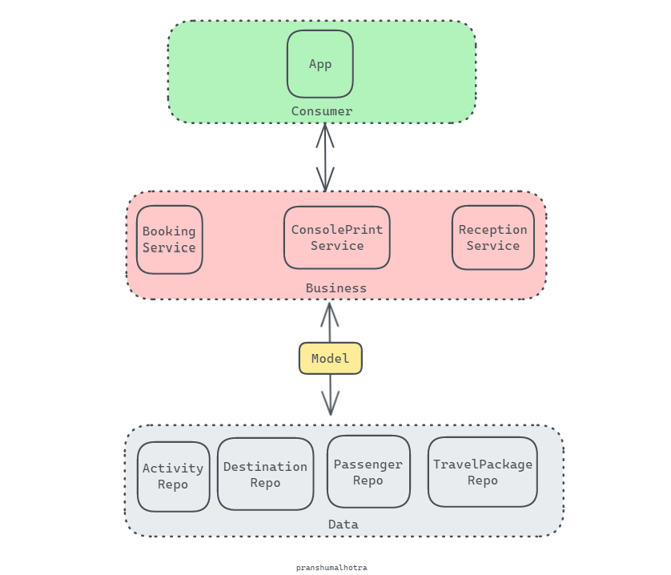
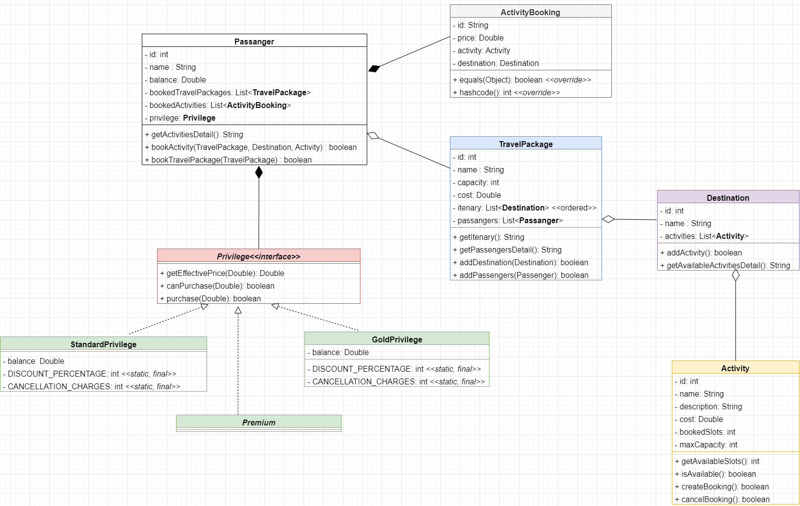

## Software Design Task (Java)

## Notes:

1. HLD: didn't have a clear picture about the expectations from the HLD diagram, create one tho.
2. LLD: Attempted it from an OOP/SOLID point of view, classes(service, repo, exception) hidden for brevity.
3. Implementation: implemented the required methods and others.
4. Unit tests: wrote 30 tests, majorly for the method `BookingSerive::bookActivityForPassenger` and the classes(model, repo) it interacts among various layers.
5. Code Documentation: attempted for service layer classes.

## HLD:


## LLD:



```
Pranshu Malhotra
pranshudee8@gmail.com
```
